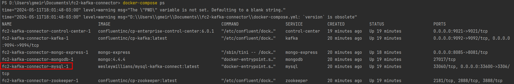
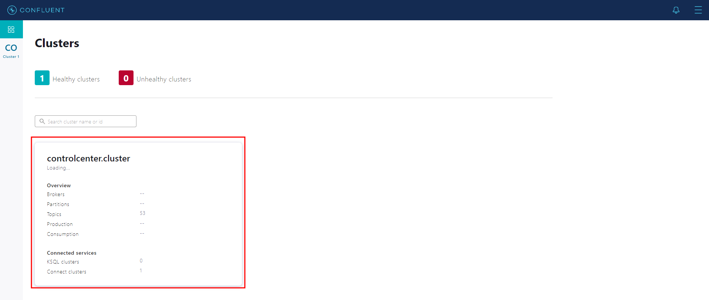
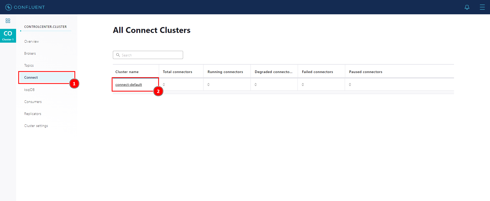
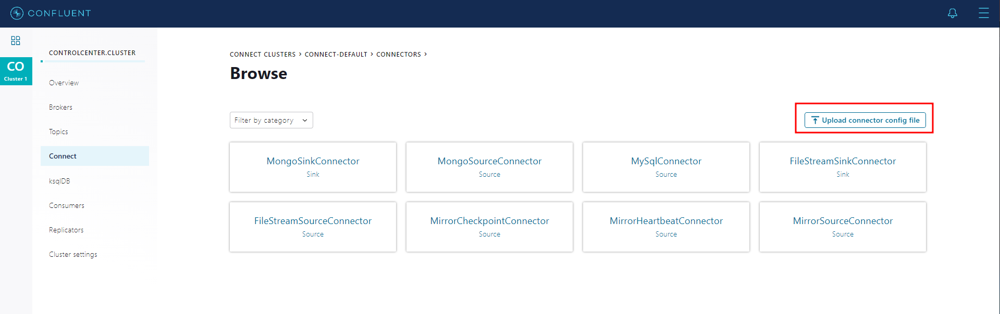
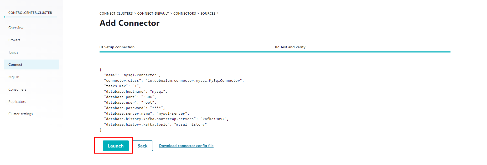
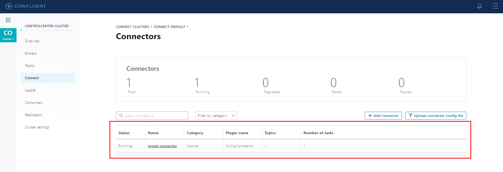

# Funcionamentos do Kafka Connector

## Primeiros passos

- Abra um terminal na raiz do projeto e utilize o comando: `docker-compose up -d`
- Para certificar que os containeres estão rodando, abra o control-center no seu navegador: `localhost:9021`

---

### Configurando nosso MySQL:

- Utilize o `docker-compose ps` e copie o nome do container que possuir `mysql`

- Logo, vamos entrar no bash do MySql: `docker exec -it fc2-kafka-connector-mysql-1 bash`
- Para acessar o db digite: `mysql -uroot -p fullcycle` e digite a senha: ~~**root**~~
- Crie a tabela de categoria: `create table categories (id int auto_increment primary key, name varchar(255));`
- Adicione um registro: `Insert into categories (name) values('Eletronicos');`

---

### Por dentro do Control-Center:
- Ao abrir o control-center, vamos clicar em cima de `controlcenter.cluster`
  
- Vamos clicar em `Connect` e depois em `connect-default`
  
- Na próxima página clicaremos no botão: `Add Conector`
- E na seguinte página, importaremos nosso arquivo de configuração dos connectors,
que esta em: `fc2-kafka-connector/connectors/mysql.properties`

- Em seguida, vá até o final da página e clique em _**Continue**_, e na página abaixo
clique em Launch.

- E assim que criado, ele irá mostrar na tela

- O gif abaixo, mostra as informações que cadastramos no MySQL

> Caso queira fazer alguns testes, adicione outras informações na tabela de `categories`
e veja que aparecerá rapidamente na interface de **_Messages_** do ControlCenter.

---